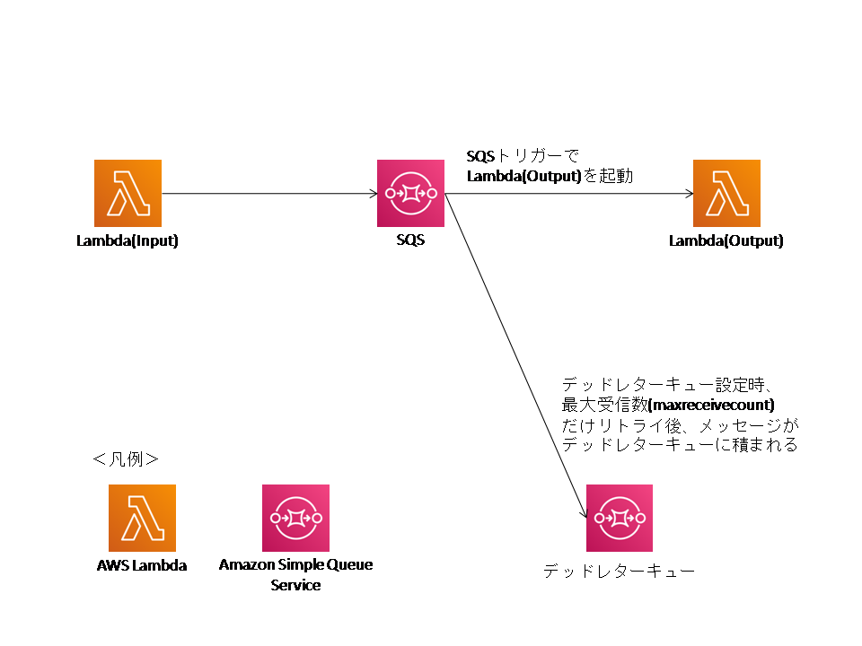

# AWS: SQS, Lambda, デッドレターキューを用いたリトライ仕様の検証

## はじめに

SQS, Lambda, デッドレターキューを用いたリトライ仕様の検証を行った。
以下が検証するアーキテクチャである。    

<div align="center">

</div>

## 検証内容
デッドレターキュー有無、SQSトリガーのバッチサイズ、による動作について検証する。

- デッドレターキュー有無  
アーキテクチ図の「デッドレターキュー」が有る場合と無い場合。

- SQSトリガーのバッチサイズ  
SQSトリガーでLambda(Output)を起動する時、何メッセージ処理するか。


## 準備

### AWSリソース
本検証でリトライ処理に関係のあるAWSリソースのパラメータについて以下に示す。

#### SQS

|項目|設定値|
|:--|:--|
|キューの属性|標準キュー|
|デフォルトの可視性タイムアウト|10秒|
|メッセージ保持期間|3分|
|配信遅延|5秒|
|メッセージ受信待機時間|3秒|
|最大受信数|5|


#### デッドレターキュー

|項目|設定値|備考|
|:--|:--|:--|
|リソース|有り / 無し|2パターンの比較|
|最大受信数(maxreceivecount)|5(有の場合) / -|同上|

#### Lambda(Input)
SQSにデータを入れるツールのため特になし

#### Lambda(Output)
|項目|設定値|備考|
|:--|:--|:--|
|バッチサイズ|1 / 3|2パターンの比較|

### ソースコード
Lambdaのソースコードを以下に示す。  
バッチサイズの検証ではLambda(Input)のソースコードを複数メッセージ送るように変更、Lambda(Output)側で複数メッセージが入っているかprintするように変更、などしたが割愛する。


#### Lambda(Input)
```
import boto3
from datetime import datetime

SQS_NAME = 'nagatest'

def lambda_handler(event, context):
    sqs_sends()


def sqs_sends():
  print('Input--------------------start')
  now = datetime.utcnow()
  now_str = datetime.strftime(now, '%Y-%m-%dT%H:%M:%S.%fZ')
  print('Input-start:  ' + now_str)

  sqs = boto3.resource('sqs')
  queue = sqs.get_queue_by_name(QueueName=SQS_NAME)
  data = '{\"k\": \"v\"}'
  msg_list = [{'Id': '1', 'MessageBody': data}]
  response = queue.send_messages(Entries=msg_list)

  now = datetime.utcnow()
  now_str = datetime.strftime(now, '%Y-%m-%dT%H:%M:%S.%fZ')
  print('Input-end:    ' + now_str)
  print('Input--------------------end')

```

#### Lambda(Output)
```
import json
from datetime import datetime
import time

def lambda_handler(event, context):
    
  print('output--------------------start')
  now = datetime.utcnow()
  now_str = datetime.strftime(now, '%Y-%m-%dT%H:%M:%S.%fZ')
  print('Output-start: ' + now_str)
  x = {"a": 1}
  y = x['b']  #エラー発生

  print('output---------------end')

```

## 動作検証結果
動作検証結果を以下に示す。

### デッドレターキュー有無

#### デッドレターキュー無
「メッセージ保持期間」の間リトライし続けた。

#### デッドレターキュー有
デッドレターキューで設定したリトライ回数だけ、リトライをした。


Lamba(Input)のログ。

```
START RequestId: 00372c89-9b69-4e3f-96ef-dad2fad7195b Version: $LATEST
Input--------------------start
Input-start: 2019-03-03T14:06:17.577386Z
Input-end: 2019-03-03T14:06:18.567554Z
Input--------------------end
END RequestId: 00372c89-9b69-4e3f-96ef-dad2fad7195b
REPORT RequestId: 00372c89-9b69-4e3f-96ef-dad2fad7195b	Duration: 1030.59 ms	Billed Duration: 1100 ms Memory Size: 128 MB	Max Memory Used: 83 MB	
```


Lamba(Output)のログ。

```
START RequestId: 57f54452-480e-529e-8feb-10a7a99af651 Version: $LATEST
output--------------------start
Output-start: 2019-03-03T14:06:27.792855Z
[ERROR] KeyError: 'b'
Traceback (most recent call last):
  File "/var/task/lambda_function.py", line 12, in lambda_handler
    y = x['b'] #エラー発生
END RequestId: 57f54452-480e-529e-8feb-10a7a99af651
REPORT RequestId: 57f54452-480e-529e-8feb-10a7a99af651	Duration: 36.41 ms	Billed Duration: 100 ms Memory Size: 128 MB	Max Memory Used: 63 MB	
START RequestId: 996ff063-75ec-5427-85f0-a49694482e8b Version: $LATEST
output--------------------start
Output-start: 2019-03-03T14:06:36.648936Z
[ERROR] KeyError: 'b'
Traceback (most recent call last):
  File "/var/task/lambda_function.py", line 12, in lambda_handler
    y = x['b'] #エラー発生
END RequestId: 996ff063-75ec-5427-85f0-a49694482e8b
REPORT RequestId: 996ff063-75ec-5427-85f0-a49694482e8b	Duration: 35.29 ms	Billed Duration: 100 ms Memory Size: 128 MB	Max Memory Used: 63 MB	
START RequestId: 21860f69-1ac0-5e9a-b96e-5b9cfb66f9ce Version: $LATEST
output--------------------start
Output-start: 2019-03-03T14:06:46.737814Z
[ERROR] KeyError: 'b'
Traceback (most recent call last):
  File "/var/task/lambda_function.py", line 12, in lambda_handler
    y = x['b'] #エラー発生
END RequestId: 21860f69-1ac0-5e9a-b96e-5b9cfb66f9ce
REPORT RequestId: 21860f69-1ac0-5e9a-b96e-5b9cfb66f9ce	Duration: 30.72 ms	Billed Duration: 100 ms Memory Size: 128 MB	Max Memory Used: 63 MB	
START RequestId: cae6c6b8-ef79-5ad9-a700-924d0ecced8d Version: $LATEST
output--------------------start
Output-start: 2019-03-03T14:06:56.181698Z
[ERROR] KeyError: 'b'
Traceback (most recent call last):
  File "/var/task/lambda_function.py", line 12, in lambda_handler
    y = x['b'] #エラー発生
END RequestId: cae6c6b8-ef79-5ad9-a700-924d0ecced8d
REPORT RequestId: cae6c6b8-ef79-5ad9-a700-924d0ecced8d	Duration: 7.12 ms	Billed Duration: 100 ms Memory Size: 128 MB	Max Memory Used: 63 MB	
START RequestId: f12ed855-e842-533b-bfca-8ca009824997 Version: $LATEST
output--------------------start
Output-start: 2019-03-03T14:07:07.288215Z
[ERROR] KeyError: 'b'
Traceback (most recent call last):
  File "/var/task/lambda_function.py", line 12, in lambda_handler
    y = x['b'] #エラー発生
END RequestId: f12ed855-e842-533b-bfca-8ca009824997
REPORT RequestId: f12ed855-e842-533b-bfca-8ca009824997	Duration: 4.60 ms	Billed Duration: 100 ms Memory Size: 128 MB	Max Memory Used: 63 MB	
```

### SQSトリガーのバッチサイズ

#### バッチサイズが1
1メッセージずつ処理する。

#### バッチサイズが3
2メッセージ以上、メッセージを取り出すことがある。


## 考察
SQSでのリトライについて、以下に考察  を示す。

|項目    |設定値|
|:--|:--|
|デッドレターキュー無しでリトライ  |「メッセージ保持期間」の間、正常処理をリトライをし続ける。</br>コーディングではなくAWSの仕組みを使ってリトライを行うことができる。|
|デッドレターキュー有りでリトライ  |デッドレターキューで設定したリトライ回数だけ、正常処理をリトライする。</br>最後まで失敗した場合、デッドレターキューに移動してそちらでエラー処理を行う。|
|バッチサイズ"1"でリトライ  |1メッセージ毎に1Lambdaリソースを実行する。</br>複数種類のマイクロサービスからSQSからメッセージが積まれる場合、バッチサイズが"1"ならば、複数種類のマイクロサービスからのメッセージをあるLambdaリソースが処理を受け持つことが無くなる。</br>そのため、疎結合に処理を実行することができる。 |
|バッチサイズ"2以上"でリトライ|複数メッセージ毎にLambdaを起動する。</br>Lambdaの同時実行数を節約できる。 |
  
## 終わりに
本アーキテクチャはシンプルな構成でした。しかし、実際のシステムでLambda(Input), Lambda(Output)はDynamoDBなど他の様々なAWSリソースへのアクセスが生じ、SQSに一旦メッセージを積んでリトライできるようにしたいという場面は多いかと思われます。  
SQSによるリトライやLambda内でのアプリケーションコードによるリトライ処理を組み合わせるなどすると良いと思います。
