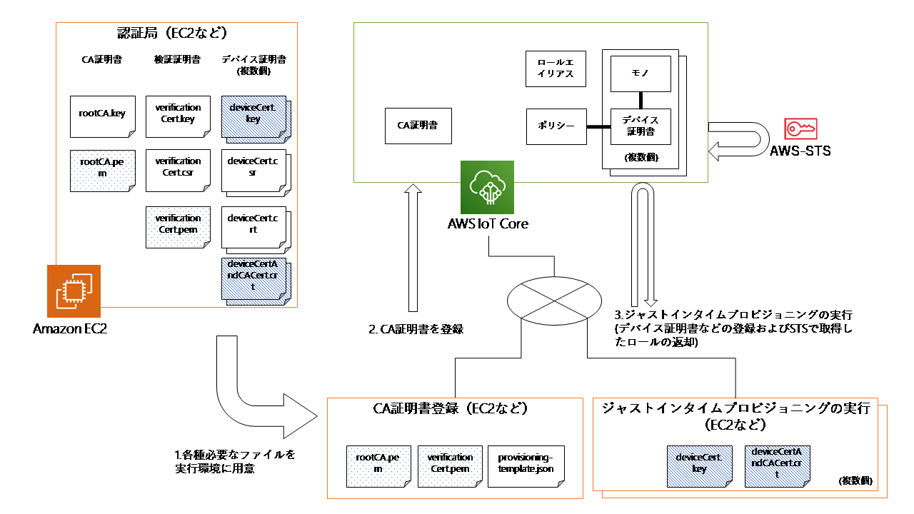

## はじめに

IoT Coreのジャストインタイムのプロビジョニング(JITP)の検証を行いました。  
想定読者は例えば以下のような事に興味がある方々です。

- ジャストインタイムのプロビジョニングについて理解したい。
- OpenSSLで証明書を作成したい。
- 作成したCA証明書をAWS IoT Coreに登録したい。
- ジャストインタイムのプロビジョニングのリクエストをPythonで書きたい。

以下が検証するアーキテクチャです。  
「複数個」と記載している箇所は、デバイスの数だけリソースが生まれます。
<div align="center">

</div>

## 検証内容
IoT Coreのジャストインタイムのプロビジョニングの登録、レスポンスの動作について検証する。

## 準備

本検証の準備内容について以下に示す。  
準備の説明における凡例は以下の通りである。  
＜凡例＞  
>はファイル出力の例を示す。  
  
>>はコンソール出力の例を示す。

<br />

### 証明書の作成
本検証に必要な秘密鍵、証明書の作成方法を以下に示す。

- CA 証明書を作成  
openssl genrsa -out rootCA.key 2048  
>rootCA.key  

openssl req -x509 -new -nodes -key rootCA.key -sha256 -days 1024 -out rootCA.pem  
>rootCA.pem  

- 検証証明書の作成

openssl genrsa -out verificationCert.key 2048
>verificationCert.key

openssl req -new -key verificationCert.key -out verificationCert.csr
Common Name (eg, your name or your server's hostname) []:{入力値※１}
>verificationCert.csr

openssl x509 -req -in verificationCert.csr -CA rootCA.pem -CAkey rootCA.key -CAcreateserial -out verificationCert.pem -days 500 -sha256
>>Signature ok  
>>subject=/C=XX/L=Default City/O=Default Company Ltd/CN={入力値※１}  
>>Getting CA Private Key  

>rootCA.srl  
>verificationCert.pem  

- デバイス証明書の作成

openssl genrsa -out deviceCert.key 2048  
>deviceCert.key  

openssl req -new -key deviceCert.key -out deviceCert.csr
Common Name (eg, your name or your server's hostname) []:{任意の値}  
>deviceCert.csr  

openssl x509 -req -in deviceCert.csr -CA rootCA.pem -CAkey rootCA.key -CAcreateserial -out deviceCert.crt -days 500 -sha256  
>>Signature ok  
>>subject=/C=XX/L=Default City/O=Default Company Ltd/CN={任意の値}  
>>Getting CA Private Key  

>deviceCert.crt

cat deviceCert.crt rootCA.pem > deviceCertAndCACert.crt  
>deviceCertAndCACert.crt


### AWSリソース
本検証で用いるAWSリソースについて以下に示す。  

#### IoT Core

- 検証用証明書の登録先エンドポイントを取得  
{入力値※１} に必要です。AWSのアカウントおよびリージョン毎に値が変わります。  
aws iot get-registration-code  
>> "registrationCode": "{入力値※１}"  

- プロビジョニングテンプレートを作成  
provisioning-template.jsonを準備。  
プロビジョニングテンプレートの記載方法は[ジャストインタイムのプロビジョニング](##参考)を参照。  
プロビジョニングテンプレート内の"templateBody"の値はString型なので見づらいので、jsonファイルで記載しておきStringへ変換するIaCプログラムを用意するなどがおすすめ。 

- ポリシーを作成
ポリシーを作成する。作成方法については、[AWS サービスの直接呼び出しの承認](##参考)を参照。

#### IAM  
- ロールを作成  
  - ロールエイリアスに該当するロールを作成しておく。  
  - ジャストインタイムプロビジョニングを実行するロールを作成する。具体例は[Setting Up Just-in-Time Provisioning with AWS IoT Core](##参考)を参照。


### ソースコード
IoT Coreへジャストインタイムプロビジョニングのリクエストを行うソースコードを以下に示す。  


```
import requests
import json
from aws_requests_auth.aws_auth import AWSRequestsAuth

account_id = 'xxxxxxxxxxxx'
endpoint = 'xxxxxxxxxxxxxx'
thing_name = 'testThingName'
role_alias = 'roleAliasName'

headers = {'x-amzn-iot-thingname': thing_name}
url = 'https://' + endpoint + '.credentials.iot.ap-northeast-1.amazonaws.com/role-aliases/' + role_alias + '/credentials'
crt = './deviceCertAndCACert.crt'
key = './deviceCert.key'
certs = (crt, key)

res = requests.get(url, cert =certs, headers=headers)
res_dict = json.loads(res.text)
print(res_dict)
```

## 動作検証手順
1. 各種必要なファイルを実行環境に用意

1. CA証明書を登録  
以下のAWS CLIコマンドを実行する。
```
aws iot register-ca-certificate --ca-certificate file://rootCA.pem --verification-cert file://verificationCert.pem --set-as-active --allow-auto-registration --registration-config file://provisioning-template.json    
```

1. ジャストインタイムプロビジョニングの実行  
IoT Coreへジャストインタイムプロビジョニングのリクエストを行うソースコードを実行する。


## 動作検証結果

- IoT Coreへリクエスト(１回目)
    - IoTへ以下の登録された。
        - デバイス証明書
        - モノ
        - デバイス証明書とモノの紐づけ
        - デバイス証明書へポリシーをアタッチ
    - 「HTTP/1.1 200 OK」が返却されない。

- IoT Coreへリクエスト(２回目以降)
    - 「HTTP/1.1 200 OK」が返却される。
    - 以下が返却される
    ```
    {
        "credentials": {
            "accessKeyId": "xxxx",
            "secretAccessKey": "xxxx",
            "sessionToken": "xxxx",
            "expiration": "xxxx"
        }
    }
    ```

## まとめ
- ジャストインタイムプロビジョニングの登録動作を確認できた。
- クリデンシャルを取得したいならば、数秒後にリトライすると取得できた。


## 参考
- [ジャストインタイムのプロビジョニング](https://docs.aws.amazon.com/ja_jp/iot/latest/developerguide/jit-provisioning.html)
- [AWS サービスの直接呼び出しの承認](https://docs.aws.amazon.com/ja_jp/iot/latest/developerguide/authorizing-direct-aws.html)
- [Setting Up Just-in-Time Provisioning with AWS IoT Core](https://aws.amazon.com/jp/blogs/iot/setting-up-just-in-time-provisioning-with-aws-iot-core/)
