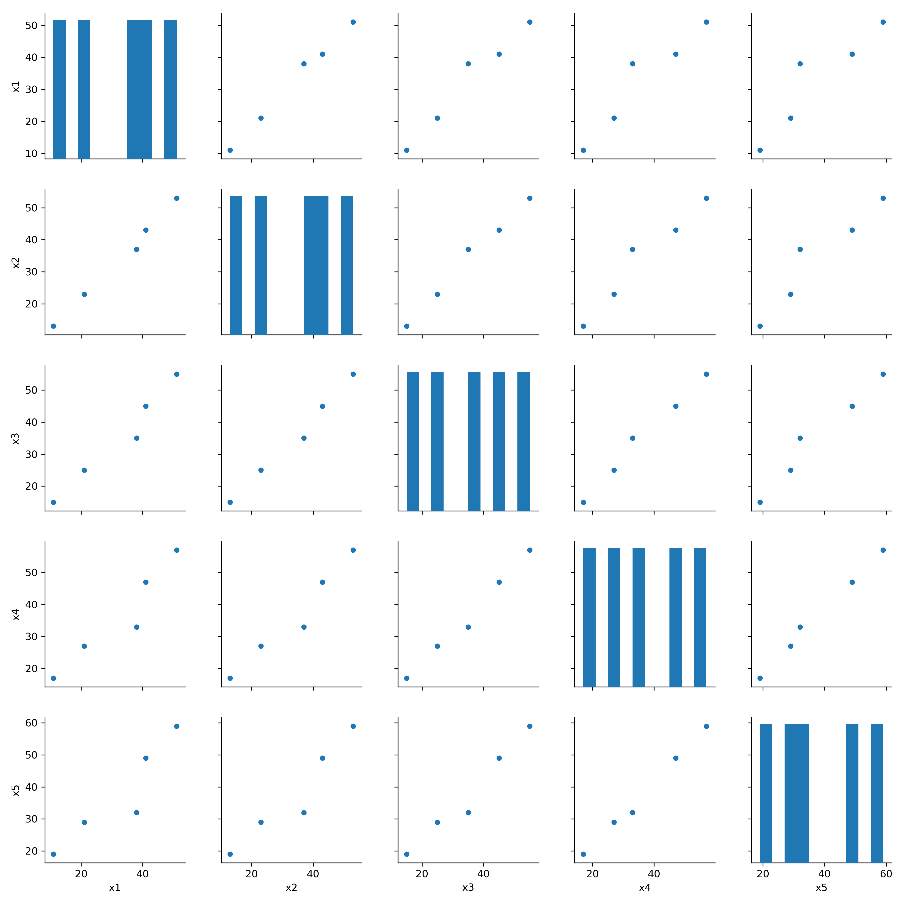
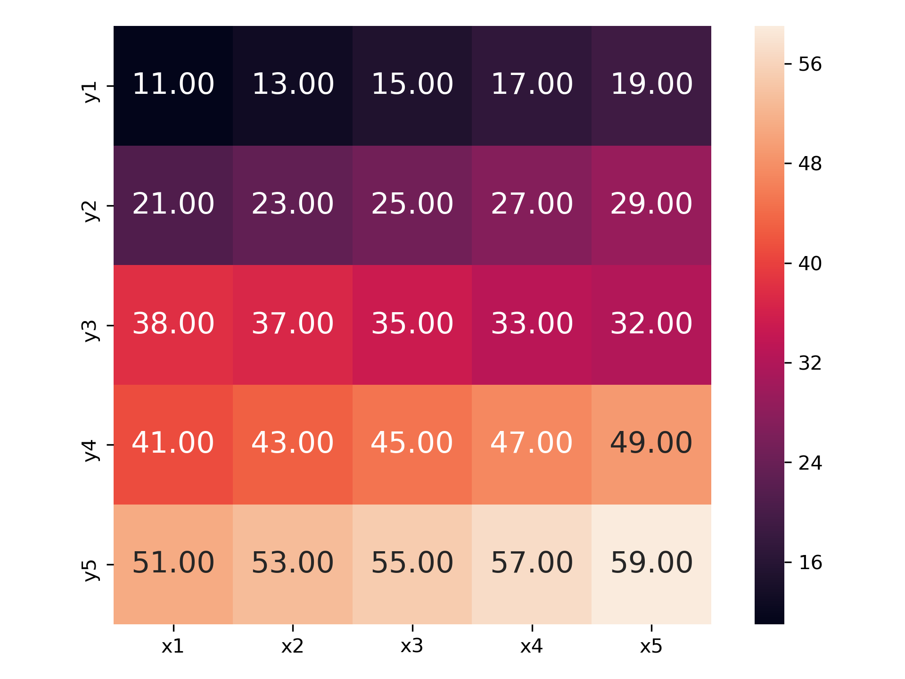

## はじめに

seabornについてメモします。
pandasのdfを引数に持ちseabornでグラフ作成するシンプルな関数を以下に示します。
今回示すのは、seabornの中のpairplotとheatmapの２種類です。


## 準備データ

sns.csvファイルを用意します。
```
x1,x2,x3,x4,x5
11,13,15,17,19
21,23,25,27,29
38,37,35,33,32
41,43,45,47,49
51,53,55,57,59
```

## ソースコード

```
import matplotlib.pyplot as plt
import seaborn as sns
import pandas as pd


def read_sns():
    df = pd.read_csv("input/sns.csv")
    return df


def sns_pairplot(df):
    df.head()
    cols = ['x1', 'x2', 'x3', 'x4', 'x5']
    sns.pairplot(df[cols], height=2.5)
    plt.tight_layout()
    plt.savefig('sns_pairplot.png', dpi=300)
    plt.show()


def sns_heatmap(df):
    cols1 = df.columns
    cols2 = ['y1', 'y2', 'y3', 'y4', 'y5']
    hm = sns.heatmap(df,
                     cbar=True,
                     annot=True,
                     square=True,
                     fmt='.2f',
                     annot_kws={'size': 15},
                     yticklabels=cols2,
                     xticklabels=cols1)
    plt.tight_layout()
    plt.savefig('sns_heatmap.png', dpi=300)
    plt.show()


def main():
    df_sns = read_sns()
    sns_pairplot(df_sns)
    sns_heatmap(df_sns)


if __name__ == '__main__':
    main()
```


## 結果
- sns_pairplot.png  
列ごとの相関を見える化
<div align="center">

</div>

- sns_heatmap.png  
データ全体の大小関係を見える化
<div align="center">

</div>
